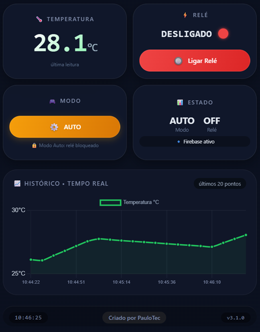

# 🔥 ESP32 SCADA IoT - Temperature Control System

Sistema de automação estilo SCADA com ESP32, capaz de monitorar temperatura em tempo real e controlar dispositivos remotamente via interface web integrada ao Firebase.

---

## 🌐 Acesse o sistema online

https://paulotec-iot.github.io/ESP32-SCADA-IoT-Temperature-Control/

---

## 📸 Preview



> Interface web responsiva com gráfico em tempo real, controle de relé e modo automático/manual.

---

## 🚀 Funcionalidades

- 📡 Leitura de temperatura com sensor **DS18B20**
- ☁️ Integração com Firebase (Realtime Database)
- ⚡ Controle de relé remoto
- 🤖 Modo automático com histerese
- 🎮 Modo manual via interface web
- 📊 Dashboard com gráfico em tempo real (Chart.js)
- 📱 Interface responsiva (mobile + desktop)

---

## 🧰 Tecnologias Utilizadas

- ESP32 (C++)
- Firebase Realtime Database
- HTML, CSS, JavaScript
- Chart.js

---

## ⚙️ Como configurar

### 🔹 ESP32

Abra o arquivo `monitor.ino` e configure:

```cpp
const char* ssid = "SEU_WIFI";
const char* password = "SUA_SENHA";
const char* host = "https://seu-projeto.firebaseio.com";

### 🔹 Monitoramento em Tempo Real

// ========== CONFIGURAÇÃO FIREBASE ==========
const firebaseConfig = {
  apiKey: "SUA_API_KEY",
  databaseURL: "https://seu-projeto.firebaseio.com/"
};
